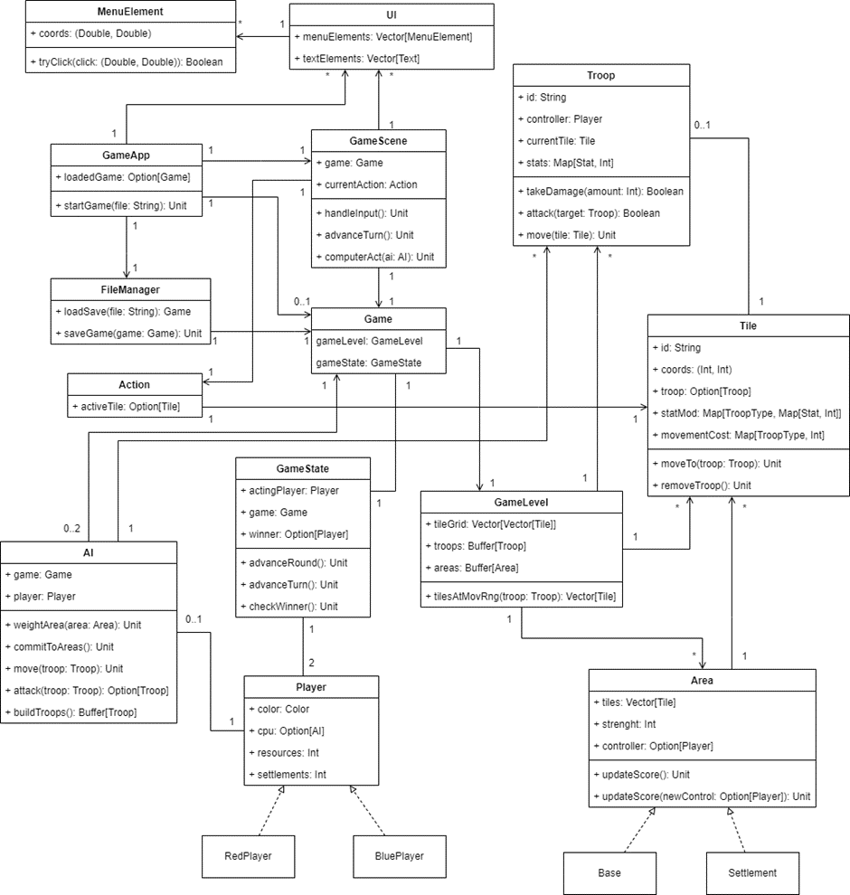

**1.	General description**

The program is a turn-based strategy game. The player controls multiple troops with different stats, types, and strengths. The player starts the game with some troops and resources. Player also gets resources each round that they can use to build troops into their base during their turn. The game-map has varying terrains, each with different stat-modifiers and movement costs. During the game, the player can capture settlements by moving their units there. The player wins the game by capturing a certain number of settlements or the enemy base. The game can be played with human or computer-controlled players.
\
\
\
**2.	Instructions**

The program is launched by running GameApp. When you run the program, the main menu pops up. There is option for “New game” and “Load game”. By choosing “Load game”, you load previous save if there is one. By choosing “New game” you get to a menu where you can choose player controllers. The default is “Player” which means that player is human. By clicking “Change” it changes to “CPU” which means that the player is computer controlled. When you click “Start game”, a new game starts, and an old save will be overwritten.

In the game you can click tiles to check information about the tile. If there is non-exhausted troop you control in the tile, a troop-menu pops up. In the troop-menu there is option for “Move”, “Attack” and “Wait”. If you click “Move”, tiles where a troop can move are highlighted and by clicking highlighted tile the troop moves there. When “Attack” is clicked, tiles which are in troop’s range are highlighted. The highlight color is red if troop does extra damage to troop in the tile. Then if you click tile in the range with an enemy troop, the troop attacks the enemy troop and is exhausted. If you click “Wait” the troop will be exhausted. 

When you click a tile in your base, a troop-build menu pops up. You can build a troop into the tile by clicking some troop in the menu that you have the required resources for.
\
\
\
**3.	Program structure**



**Game:**\
The program has Game-class which stores GameLevel and GameState which contain all information about the game. 

**GameState and Player:**\
GameState tells who is acting Player or a potential winner. It has advanceTurn-method which changes acting Player. AdvanceRound-method refreshes Troops, updates Areas, increases players resources and calls checkWinner which updates winner if victory-condition is met. 

Player is sealed abstract class which has two instance-objects: RedPlayer and BluePlayer. In them are stored count of resources and controlled settlements, and potentially player’s AI.

**GameLevel, Troop, Tile and Area:**\
GameLevel stores 2d-array of Tiles, which represents game-map. It also stores all game’s Troops and Areas in Buffer. GameLevel has methods for managing Troops and returning relevant Tiles. For example, tilesAtMovementRange-method returns all Tiles given Troop can move. 

Troop is trait which is used by different troops in the game. Troop has id-String, controlling Player, current Tile, and its type and stats. Troop has some base stats which are stored as Int value. As Troop stats can be modified it has mutable Map in which each stat is associated with some Int. Upon Troop creation, that Int is base stat-value. Troop has method for move, which moves Troop to given Tile. It has method for attack, which attacks with the Troop to given target and returns in Boolean whether target dies. Troop also does extra damage by rule which extraDamage-method defines. 

Tile is trait which is used by different terrains in the game. Tile has id-String, coordinates, potentially Troop, movement cost and stat modifiers. Movement cost and stat modifiers are Map in which each troop type is associated to some movement cost or stat modifiers. When moveTo-method is called, Tile stores given Troop and applies stat modifiers to it. RemoveTroop-method does the opposite.

Area is abstract class which classes Settlement and Base implements. Area has collection of Tiles which are the tiles that belongs to the Area. Area also has potentially a controlling Player. Area has updateControl-method which compares players Troop count in the Area, and calls updateScore-method accordingly. In Settlement updateScore-method increases conquerors settlement-count. In Base the method sets old controllers base as captured.


**GameApp, GameScene and UI:**\
The graphical interface is a key part of the program which GameApp handles. GameApp has different scenes for different menus and loading screen. By startGame-method GameApp loads Game by given filename and creates GameScene.
GameScene is the Scene for the game. It renders initial GameLevel and renders updates for Troops and Areas in GameLevel. GameScene takes input from human player by handleInput-method. HandleInput does things according to what current Action is. Action is sealed trait which has potentially active tile stored in it. Action is used to represent different UI-actions, for example focusing on Tile, moving with Troop, or attacking with Troop. GameScene also has computerAct-method which calls AI-actions and then renders updates.

UI is an abstract class extending Pane, used by all UI-elements in the program. UI has its position, element dimensions, MenuElements and Text-elements stored in it. MenuElement has name, dimensions, and coordinates. Its tryClick-method returns true if given click coordinates are inside the MenuElement. Text-elements are stored in UI to update text in them.

**FileManager and AI:**\
FileManager handles loading and saving the game. It’s gameMapReader-method returns map according to given map-file. LoadGame-method returns Game according to given save file. SaveGame-method saves game to saveFile.xml according to given Game.

AI is a class managing AI-algorithms and AI-actions. AI has its Player and Game stored in it. AI has move-method which moves given Troop to some determined Tile. Attack-method chooses target Troop to attack and returns it in Option. BuildTroop-method builds troops according to AI’s build-target.
\
\
\
**4.	Files**

The program uses text-files that are in xml-format to load and save the game. An example save file looks like this:
```xml
<save>
	<game_map>map_1.txt</game_map>
	<game_state>
		<player color="Red">
			<resources>10</resources>
			<control>CPU</control>
		</player>
		<player color="Blue">
			<resources>10</resources>
			<control>Player</control>
		</player>
		<acting_player>Red</acting_player>
	</game_state>
	<areas>
		<base color="Red">
			<tiles>
				<tile>0,10</tile><tile>1,10</tile>
				<tile>0,11</tile><tile>1,11</tile>
			</tiles>
			<strength>3</strength>
		</base>
		<base color="Blue">
			<tiles>
				<tile>59,20</tile><tile>60,20</tile>
				<tile>59,21</tile><tile>60,21</tile>
			</tiles>
			<strength>3</strength>
		</base>
		<settlement>
			<tiles>
				<tile>20,10</tile><tile>21,10</tile>
				<tile>20,11</tile><tile>21,11</tile>
			</tiles>
			<controller>None</controller>
			<strength>1</strength>
		</settlement>
	</areas>
	<troops color="Red">
		<troop>
			<type>solider</type>
			<location>2,11</location>
			<hp>full</hp>
			<status>ready</status>
		</troop>
	</troops>
	<troops color="Blue">
		<troop>
			<type>tank</type>
			<location>62,21</location>
			<hp>full</hp>
			<status>ready</status>
		</troop>
	</troops>
</save>
```

The program uses text-file for loading a map. In map-file each tile-type is represented by some number. In smaller scale it looks like this:

```text
1 1 1 1 2 2 1 1 
1 1 3 1 2 2 1 1 
1 1 3 3 2 2 1 1 
1 1 1 1 2 2 1 1 
1 1 1 1 2 2 1 1 
1 4 4 1 2 2 1 1 
1 4 4 1 2 2 1 1 
```
